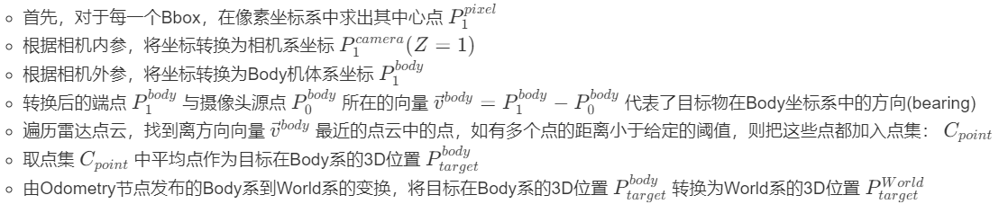

<!--
 * @Author: Zhao Hangtian jp-vip@qq.com
 * @Date: 2023-11-22 07:49:32
 * @LastEditors: Zhao Hangtian iamzhaohangtian@gmail.com
 * @LastEditTime: 2024-05-30 13:20:19
 * @Description: 
 * 
 * Copyright (c) 2024 by Zhao Hangtian, All Rights Reserved. 
-->
<h1 align="center">ROS1/ROS Neotic Object Detecion Inference</h1>

# Highlight

- 动态支持多路图像topic的目标检测

- 兼容 Image / CompressedImage 消息类型

- 推理模型解耦, 可选择任意pt模型.


# 1. 激活环境
确保ROS1服务启动了`roscore`

激活ros workspace(`cd 本工程目录`)

`source devel/setup.bash`

如果过程出错就删除`rm -rf build devel`然后重新编译`catkin_make`

本工程基于ultralytics的封装模型进行示范, jetson的环境搭建请参考[ultralytics的指南](https://docs.ultralytics.com/zh/guides/nvidia-jetson/)

# 2. 编译
`catkin_make`

# 3. 准备数据(可选)


## 从相机创建流(首选)

假设你已经有了相机驱动topic,比如oak相机组:

`cd /home/nv/qiuzh/oak_src`

`source /home/nv/qiuzh/oak_ws/devel/setup.sh`


可以用`-h`查看所有参数

`roslaunch oakcam_ffc_4p_ros  oakcam_ffc_4p.launch fps:=1`

## 从文件夹创建流(仅测试)
`rosrun my_image_publisher my_image_publisher /home/nv/zht_ws/deving/val_img`


# 4. yolo推理(关键)
## 用法
`Usage: rosrun py_yolov8 py_yolov8.py <model_path> <image_topic1> [<image_topic2> ...]`


`image_topic1 image_topic2 image_topic3 ... image_topicN` 换成你实际的topic, **本项目兼容Image/CompressedImage消息类型**, 但如无网络传输需求推荐使用Image

## 例子
支持指定推理模型和动态数量图像topic输入:

`rosrun py_yolov8 py_yolov8.py best.pt /oak_ffc_4p/image_CAM_A/compressed /oak_ffc_4p/image_CAM_B/compressed /oak_ffc_4p/image_CAM_C/compressed /oak_ffc_4p/image_CAM_D/compressed`

## 输出格式

对于每个topic,会输出相应的annotated_image和bbox_info

比如`/oak_ffc_4p/image_CAM_A/compressed`对应有`/detection/image_CAM_A/annotated_image`和`/detection/image_CAM_A/bbox_info`

### bbox_info的定义如下
```
float32[] bbox_xyxy
float32[] bbox_cls
float32[] bbox_conf
```


## 性能

作为参考,yolov8在nvidia jetson orin nx 16gb上的推理速度大约是30ms/batch


# 5. 其他
因为包含了自定义消息类型,所以需要先激活本工程workspace才能看到bbox_info格式


# TODO
- [ ] model兼容ONNX
- [ ] model兼容tensorRT


<h1 align="center">Coordinates computation</h1>

# 1. 启动节点

- 首先确保启动相机驱动节点与雷达/里程计节点
- 随后启动检测环境节点
  ``` 
    roslaunch py_yolov8 yolov8.launch
  ```
  - launch文件参数：
    - 设置image_topics以更改输入检测图像的topic
    - 设置bbox_conf_thre以设置发布bbox的置信度阈值
    - 设置save_img和save_frequency分别控制是否保存检测图像和保存频率
- 然后启动坐标计算节点
  ``` 
    roslaunch target_dist_calculator target_dist.launch
  ```
  - launch文件参数：
    - 设置dist_thre_add_point与dist_thre_final参数控制点云的筛选
    - 设置camera_type参数控制飞机内外参，目前可选值如下：
      - '1': 适用于相机在四个机臂末端的大飞机
      - '2': 适用于相机在机身中心周围的小飞机

# 2. 程序框架


- 坐标计算方法
  - 首先，对于每一个Bbox，在像素坐标系中求出其中心点 $P^{pixel}_{1}$
  - 根据相机内参，将坐标转换为相机系坐标 $P^{camera}_{1} (Z=1)$
  - 根据相机外参，将坐标转换为Body机体系坐标 $P^{body}_{1}$
  - 转换后的端点 $P^{body}_{1}$ 与摄像头源点 $P^{body}_{0}$ 所在的向量 $\vec{v}^{body} = P^{body}_{1}-P^{body}_{0}$ 代表了目标物在Body坐标系中的方向(bearing)
  - 遍历雷达点云，找到离方向向量 $\vec{v}^{body}$ 最近的点云中的点，如有多个点的距离小于给定的阈值，则把这些点都加入点集： $C_{point}$
  - 取点集 $C_{point}$ 中平均点作为目标在Body系的3D位置 $P^{body}_{target}$
  - 由Odometry节点发布的Body系到World系的变换，将目标在Body系的3D位置 $P^{body}_{target}$ 转换为World系的3D位置 $P^{World}_{target}$
- Latex渲染错误时请下图参见：


# 3. 注意

- 相机位置变更时，需要更改如下参数:
```
self.rotation_matrix
self.translation_vector
def check_point_validation(self, camera, point)
```
- 如需更改检测频率，可直接更改相机驱动频率fps：
```
roslaunch oakcam_ffc_4p_ros oakcam_ffc_4p.launch fps:=10
```
